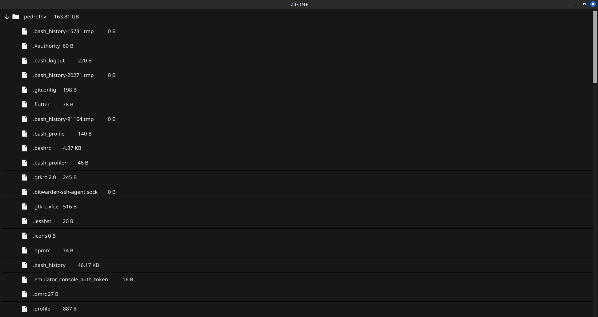

# DiskGo

DiskGo is a Go application designed to make disk/drive reading and analysis easy. The program traverses directories, reads files, and analyzes disk usage in a simple way.

## Features

- Recursive scanning of directories and files
- Displays the directory tree structure with file sizes
- Uses concurrency for faster scanning
- Human-readable size formatting (B, KB, MB, GB, TB)

## Screenshot



## Dependency Installation (Linux)

Before running DiskGo, install the necessary dependencies for Fyne:

```sh
sudo apt-get update
sudo apt-get install libx11-dev libxcursor-dev libxrandr-dev libxinerama-dev libxi-dev libgl1-mesa-dev libxxf86vm-dev
```

### ARM64 Cross-Compilation Requirements

To build DiskGo for ARM64 (e.g., using `make build-all` or `make build-linux-arm64` on an x86_64 system), you must install the ARM64 cross-compiler toolchain:

```sh
sudo apt-get update
sudo apt-get install gcc-aarch64-linux-gnu g++-aarch64-linux-gnu
```

When building for ARM64, set the `CC` environment variable so Go uses the correct cross-compiler:

```sh
CGO_ENABLED=1 GOOS=linux GOARCH=arm64 CC=aarch64-linux-gnu-gcc go build -ldflags="-s -w -X main.version=$(git describe --tags --always --dirty 2>/dev/null || echo 'dev')" -o build/diskgo-linux-arm64 src/main.go
```

#### Additional ARM64 Library Dependencies

When cross-compiling for ARM64, you must also install the ARM64 versions of the required libraries. On Ubuntu/Debian, run:

```sh
sudo dpkg --add-architecture arm64
sudo apt-get update
sudo apt-get install libgl1-mesa-dev:arm64 libx11-dev:arm64 libxrandr-dev:arm64 libxxf86vm-dev:arm64 libxi-dev:arm64 libxcursor-dev:arm64
```

> [!WARNING]
> On most desktop Ubuntu/Debian systems, ARM64 development libraries (e.g., `libgl1-mesa-dev:arm64`, `libx11-dev:arm64`) may not be available in the package repositories. If you see "Unable to locate package ...:arm64", you will not be able to cross-compile DiskGo for ARM64 with Fyne on this system.
> To build for ARM64, use a real ARM64 device (such as a Raspberry Pi), an ARM64 VM, or a Docker/QEMU ARM64 build environment with the required libraries installed.

If these libraries are missing, you will see linker errors like:

```sh
/usr/lib/gcc-cross/aarch64-linux-gnu/13/../../../../aarch64-linux-gnu/bin/ld: cannot find -lGL: No such file or directory
/usr/lib/gcc-cross/aarch64-linux-gnu/13/../../../../aarch64-linux-gnu/bin/ld: cannot find -lX11: No such file or directory
... (other similar errors)
collect2: error: ld returned 1 exit status
```

These errors mean your system is missing the ARM64 library dependencies. Install them as shown above before building.

If you do not install the cross-compiler, you may see errors like:

```sh
gcc_arm64.S: Assembler messages:
gcc_arm64.S:30: Error: no such instruction: `stp x29,x30,[sp,'
... (many similar errors)
```

These errors mean your system is missing the ARM64 toolchain. Install it as shown above.

## Compilation and Distribution

### Simple Compilation

1. Build the project:

    ```sh
    go build -o diskgo src/main.go
    ```

2. Run the binary:

    ```sh
    ./diskgo
    ```

### Optimized Compilation (Recommended for Distribution)

To create an optimized binary for distribution on any Linux PC:

```sh
# using the build script
./build.sh

# or using Make
make build

# or manually with optimizations
CGO_ENABLED=1 go build -ldflags="-s -w" -o diskgo src/main.go
```

### Multi-Architecture Compilation

To create binaries for different Linux architectures:

```sh
# all supported architectures
make build-all

# or individually:
make build-linux-amd64    # for Intel/AMD 64-bit processors
make build-linux-arm64    # for ARM 64-bit processors
make build-linux-386      # for 32-bit processors

#### Additional 32-bit (i386) Library Dependencies

For 32-bit builds, you may also need to install `libxinerama-dev:i386`:

```sh
sudo apt-get install libxinerama-dev:i386
```

If you see errors about `-lXinerama`, this package is missing.

```sh
### System-wide Installation

To install DiskGo for all system users:

```sh
# using Make (recommended)
make install

# or manually
sudo cp diskgo /usr/local/bin/
```

### Distribution

The compiled binary (`diskgo`) is completely standalone and can be run on any Linux system with the following graphical dependencies installed (Fyne library dependencies):

```sh
# Ubuntu/Debian
sudo apt-get install libx11-dev libxcursor-dev libxrandr-dev libxinerama-dev libxi-dev libgl1-mesa-dev

# CentOS/RHEL/Fedora
sudo yum install libX11-devel libXcursor-devel libXrandr-devel libXinerama-devel libXi-devel mesa-libGL-devel

# Arch Linux
sudo pacman -S libx11 libxcursor libxrandr libxinerama libxi mesa
```

## Usage

By default, DiskGo scans the current user's home directory. You can change this in the `userHomeDirAsRoot` variable in the `src/main.go` file (true or false).

### Quick Run (Development)

You can also quickly run the application without compiling using:

```sh
go run src/main.go
```

## Installation

Clone the repository and run using Go:

```sh
git clone https://github.com/pepeufbv/DiskGo.git
cd DiskGo
go run src/main.go
```

## License

This project is licensed under the MIT License - see the [LICENSE](LICENSE) file for details.
